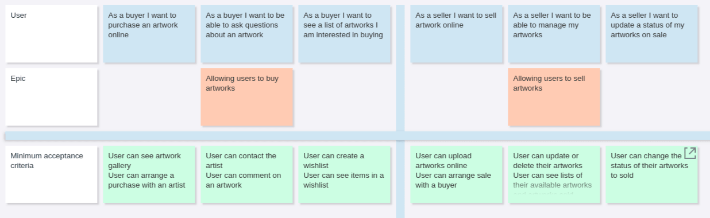
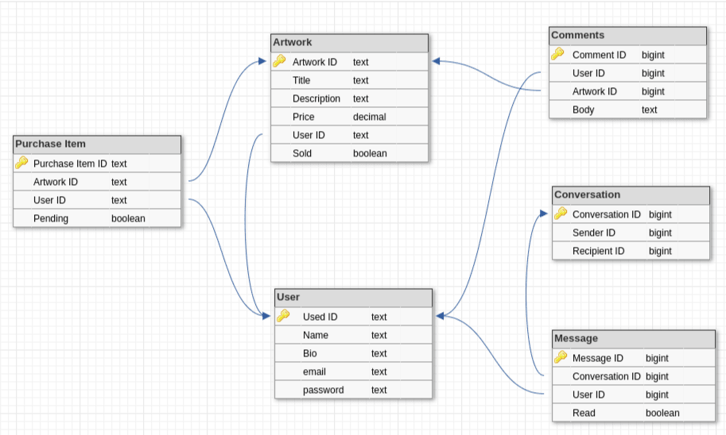

# README

Project Snowflakes was created as an assignment for a GenTech-GLG course at Coder Academy in March 2020

Heroku app link: [Snowflakes](http://intense-beach-26117.herokuapp.com/)

Github:[GitHub](https://github.com/MGorin84/Snowflakes)

Trello board: [Trello](https://trello.com/b/rypa01GN/snowflakes)

Wireframes: [Wireframes](https://ninjamock.com/s/KKKJWGx)

Moodboard:[Figma](https://www.figma.com/file/ttrm0AsG68hhzqNV9w4C41/Snowflakes?node-id=0%3A1)

ERD: [ERD](https://dbdesigner.page.link/4HSx9Y2fFggrLmDk7)

## Instructions for running the app

To run the Snowflakes app, please complete the following steps:

- Visit the Heroku site for Snowflakes

- Test the site by creating an account or using the existing account details created for testing.

Functionality included in the app you can test includes

- Logging in
- Creating a new user account
- As an existing user, acting as a buyer

    * editing user information
    * browsing through gallery of products
    * commenting on products
    * adding products to wishlist
    * messaging owners of the products to arrange a sale

- As an existing user, acting as a seller

    * adding, editing and deleting products
    * reading comments on products
    * messaging potential buyers to arrange a sale
    * setting existing product to "sold" and deleting them from the gallery view

Login details are provided for testing:

Jo is an artist

Anna is a buyer

## Identification of the problem you are trying to solve by building this particular marketplace app.

Snowflakes is an online marketplace where independent artists can show and sell their work and also for art lovers looking to buy. It is a virtual gallery for busy buyers looking for interesting non-commercial artworks to add to their collection and a safe place for artists to display and sell their work. There is a comment section attached to artworks which is only visible to artist where potential buyers can leave their complements. The application is also equipped with a messenger allowing users to communicate and arrange payments and delivery. 

## Why is it a problem that needs solving?

Galleries are usually the only places we think of in terms of displaying and buying art. But for independent artists at the beginning of their career it is not easy to find a gallery willing to take their work and their work can stay unseen for a long time leaving it's owner with no income and appreciation. 
Buying art only through physical galleries is also restricting for potential buyers as their choices are limited and they might be short in time to visit places.
This is why Snowflakes is a great place where the needs of both artists and buyers are met. It is a virtual gallery where artists can display their work and connect to potential buyers and where time short art lovers can choose from displayed pieces of art not available through physical galleries.

## Purpose 

Snowflakes os made for a purpose of selling and buying artworks online.

## Functionality / features 

Snowflakes requires it's user to sign up first or sign in as an existing user. An existing user can edit their profile information or delete their account. User model was created with Devise gem with additional attributes added to it during the development.

The application allows an existing user see a gallery of artworks, uploaded by other users, leave comments to those artworks, add those artworks to wishlist.

All existing users can upload new artworks to sell. Those artworks are visible to other users but can only be edited or deleted by the user they belong to. There is also a "Mark as sold" button, which removes the artwork it is applied to from gallery view, but keeps it visible to the owner through dashboard view.

Dashboard view has it's owners artworks available, artworks marked as sold and artworks currently added to wishlist. 

There is an in-built messenger allowing users to communicate and arrange sales. It is accessible from any page by clicking a mailbox button which takes a user to the list of other users. There is also a link added to every artwork item added to wishlist which allows a user to message the artist that artwork belongs to.

## Sitemap 

## Target audience 

Snowflakes targets independent artists willing to display and sell their art online. It could be artists at the beginning of their career and not showing their work in physical galleries or mature artists willing to expand their group of buyers.
It also created for artwork lovers looking to buy online due to interest in independent art or shortage in time to vesit physical galleries.

## Tech stack (e.g. html, css, deployment platform, etc)

- Rails

Snowflakes is written in Ruby using Rails.
Rails is a development MVC framework used for web application written on Ruby, which provides developers with a database structure, controllers and views

- HTML/erb

Views for Snowflakes are written in HTML with embedded Ruby code.

- CSS

Stylesheets are created with CSS. There is a big area of improvement in styling, which is currently work in progress.

- Deployment platform

Snowflakes applications runs on Heroku which is a cloud base platform hosting web applications.

- Database

PostgreSQL is used in Snowflakes development as it works better on Heroku deployment platform.

- Gems

Devise gem was used to create User model which equipped the app with all the relevant functions like signing in and out, creating password, changing password ect.

Faker is another gem which was used during development to create data for testing

- Storage

AWS Amazon Simple Storage Service(S3), cloud-based platform, was used to store images 

## User stories

Snowflakes has 2 potential kind of user:

- a seller, who is an artist;

- and a buyer willing to buy

Based on this plan I prepared some basic user stories using an online tool [Cardboard](https://cardboardit.com/)

As a seller I want to sell artwork online:

- User can upload artworks online
- User can arrange sale with a buyer

As a seller I want to be able to manage my artworks:

- User can update or delete their artworks
- User can see lists of their available artworks and artworks sold

As a seller I want to update a status of my artworks on sale:

- User can change the status of their artworks to sold

As a buyer I want to purchase an artwork online: 

- User can see artwork gallery
- User can arrange a purchase with an artist

As a buyer I want to
be able to ask questions about an artwork:

- User can contact the artist
- User can comment on an artwork

As a buyer I want to
see a list of artworks I am interested in buying:

- User can create a wishlist
- User can see items in a wishlist

## Explain the different high-level components (abstractions) in your app

Routes 

Models

Views

Controllers

## Detail any third party services that your app will use

Devise gem was used to create User model which equipped the app with all the relevant functions like signing in and out, creating password, changing password ect.

AWS Amazon Simple Storage Service(S3), cloud-based platform, was used to store images 

## Describe your projects models in terms of the relationships (active record associations) they have with each other

Between Snowflakes Active Record models following associations are present:

User:

has_many :artworks;
has_many :comments;
has_many :purchase_items;
has_many :conversations (through sender_id).

Artwork:

belongs_to :user;
has_one :purchase_item;
has_many :comments.

Comment:

belongs_to :artwork;
belongs_to :user.

Purchase_item:

belongs_to :artwork;
belongs_to :user.

Conversation:

belongs_to :sender (class "User"0);
belongs_to :recipient (class "User");
has_many :messages.

Message:

belongs_to :conversation;
belongs_to :user.

## Discuss the database relations to be implemented in your application

Snowflakes database only has one to one and one to many relations as it was no need to use many to many association. 

## Provide your database schema design

## Describe the way tasks are allocated and tracked in your project

Snowflakes is a single developer project created as a part of the assignment at Coder Academy

It started with an idea of an application and a quick handwritten list of features planned for development

Planning process included:

- Creating Trello board for a project with all the technical and documentation requirements for the assignment. Technical requirements were marked as the highest priority with optional features being the lowest. 

- Drawing site map and wire frames for future app

- Drawing ERD for future database, which was edited a few times during the development

The original plan for Snowflakes included:

- Having a user acting as buyer and seller with restriction on ability to edit and delete products. This part was achieved through development. It was also an option of having an admin-user which is still work in progress

- Having an artwork-product available to view, comment on, add to cart and pay for. Payment option is therefore still work in progress and instead of intended cart the app is equipped with a wishlist. It was also decided during the development to created a messenger which allows users to communicate and arrange sales. Items added to wishlist have links to message their owners so buyers don't need to look for particular artists in their mailbox.

- Having a colour theme reflected on our mood board. There were some styling applied to the application but as it still needs improvement it is considered to be work in progress

- Having appropriate documentation completed which was achieved during the work on the project

- Getting comfortable with the Rails project which was achieved through hard work :)

